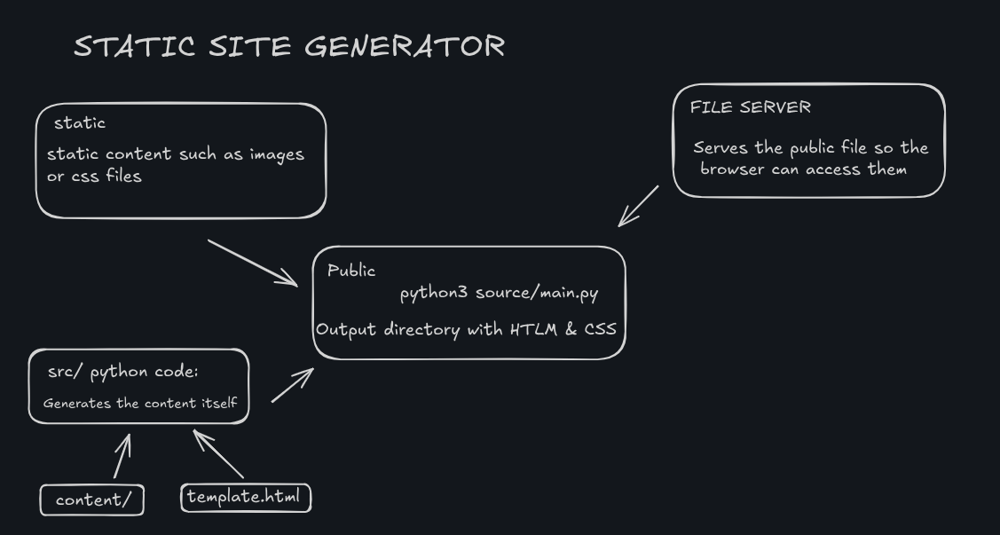
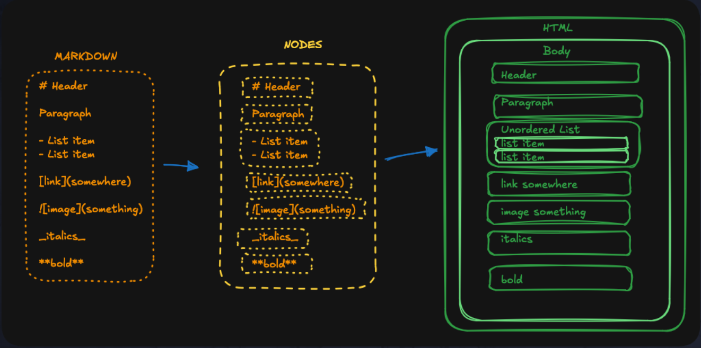

## Pluto

A Server-Side-Generated(SSG) web framework to generate HTLM using markdown.

Popular SSG frameworks are Nextjs,Hugo,Astro etc. This is built upon the fundamental process as those frameworks work on.

Written in Python3!

### Flow of working:



-  Markdown files are in the /content directory. A template.html file is in the root of the project.
-  The static site generator (the Python code in src/) reads the Markdown files and the template file.
-  The generator converts the Markdown files to a final HTML file for each page and writes them to the /public directory.
-  We start the built-in Python HTTP server (a separate program, unrelated to the generator) to serve the contents of the /public directory on http://localhost:8888 (our local machine).
-  We open a browser and navigate to http://localhost:8888 to view the rendered site.

### SSG Process:

1. Delete everything in `/public` folder.
2. Copy any static assets to the `/public` directory.
3. Generate an HTLM page for each MARKDOWN(**.md**) file in `/content` directory. For each markdown file:
   -  Open the file & read its contents
   -  Split the markdown into "blocks" (e.g. paragraphs, headings, lists, etc.).
   -  Convert each block into a tree of `HTLMNode` objects. For inline elements (like bold text, links, etc.) we will convert: `Raw markdown -> TextNode -> HTMLNode`
   -  Join all `HTMLNode` blocks under one large parent HTMLNode for the pages.
   -  Use a recursive `to_htlm()` method to convert the HTLMNode and all its nested node in a giant string to inject in a template as body
   -  Write the full HTML string to a file for that page in the `/public` directory.



Here’s a clear, concise README section that explains how everything works and what each file does, following your structure and style. You can add this after your SSG process section:

---

### How does the codebase work?

**Directory structure:**

```
/content         # Your markdown files (.md)
/static          # Static assets (images, CSS, etc.)
/src             # The Python source code for the SSG
/public or /docs # The generated HTML site
template.html    # The HTML template with placeholders
```

**Key files and their roles:**

-  **main.py**  
   Orchestrates the build process:

   -  Cleans and copies static assets
   -  Finds all markdown files
   -  Converts each markdown file to HTML using the template
   -  Writes the output to `/public` (or `/docs`)

-  **util.py**  
   Handles the core logic for:

   -  Splitting markdown into blocks
   -  Detecting block types (heading, paragraph, list, etc.)
   -  Parsing inline markdown (bold, italic, code, links, images)
   -  Converting markdown to a tree of nodes
   -  Rendering nodes to HTML

-  **textnode.py**  
   Defines `TextNode` and `TextType` for representing pieces of text and their types (plain, bold, italic, code, link, image).  
   Also includes logic to convert `TextNode` to HTML nodes.

-  **htmlnode.py, parentnode.py, leafnode.py**  
   Define the node tree structure:

   -  `HTMLNode`: Base class for all nodes
   -  `ParentNode`: For elements with children (like `<div>`, `<ul>`, `<p>`)
   -  `LeafNode`: For elements with no children (like text, `<b>`, `<a>`, ``)

-  **template.html**  
   The HTML template file. Contains placeholders like `{{ Title }}` and `{{ Content }}` that get replaced with the page title and generated HTML.

---

### What does it support?

-  Headings (`#` through `######`)
-  Paragraphs
-  Bold (`**bold**`)
-  Italic (`_italic_`)
-  Inline code (`` `code` ``)
-  Links (`[text](url)`)
-  Images (``)
-  Unordered lists (`- item`)
-  Ordered lists (`1. item`)
-  Blockquotes (`> quote`)

**Limitations:**

-  No support for fenced code blocks (triple backticks), tables, HTML passthrough, nested lists, or escaping special characters.
-  If your markdown is invalid, the build may fail.

---

### How to use

1. Put your markdown files in `/content`.
2. Put your static assets in `/static`.
3. Edit `template.html` as you like.
4. Run the build script (`main.sh`, `build.sh`, or `python3 src/main.py`).
5. Serve the `/public` (or `/docs`) directory with a static file server.
